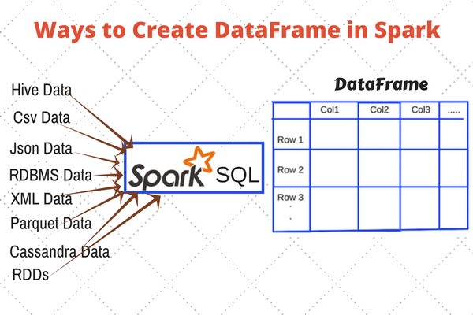

### Dataframes in PySpark

In Apache Spark, a DataFrame is a distributed collection of rows under named columns. 

In simple terms, they are similar to a table in relational database or an Excel sheet with Column headers. 

Dataframes also share some common characteristics with RDDs:

* Immutable in nature : We can create a DataFrame / RDD once but can’t change it. And we can transform a DataFrame / RDD after applying transformations.

* Lazy Evaluations:   Which means that a task is not executed until an action is performed.

* Distributed: RDD and DataFrames are both distributed in nature.

---------

#### Why DataFrames are Useful ?

- higher level of abstraction (more user friendly API than RDD API)

- DataFrames are designed for processing large collection of structured or semi-structured data.(DataFrames in Apache Spark have the ability to handle petabytes of data)

- Observations in Spark DataFrames are organised under named columns, which helps Apache Spark to understand the schema 
of a  DataFrame. This helps Spark optimize execution plan on these queries.

---------

#### DataFrames support a wide range of data format and sources.

---------

#### Important classes of Spark SQL and DataFrames:

`pyspark.sql.DataFrame` A distributed collection of data grouped into named columns.

`pyspark.sql.Column` A column expression in a DataFrame.

`pyspark.sql.Row` A row of data in a DataFrame.

`pyspark.sql.GroupedData` Aggregation methods, returned by DataFrame.groupBy().

`pyspark.sql.DataFrameNaFunctions` Methods for handling missing data (null values).

`pyspark.sql.DataFrameStatFunctions` Methods for statistics functionality.

`pyspark.sql.functions` List of built-in functions available for DataFrame.

`pyspark.sql.types` List of data types available.

`pyspark.sql.Window` For working with window functions.

---------

#### Useful functions on `pyspark.sql.functions`

`lit`: 'Creates a :class:`Column` of literal value.',

`col`: 'Returns a :class:`Column` based on the given column name.',

`column`: 'Returns a :class:`Column` based on the given column name.',

`asc`: 'Returns a sort expression based on the ascending order of the given column name.',

`desc`: 'Returns a sort expression based on the descending order of the given column name.',

 `upper`: 'Converts a string expression to upper case.',
 
 `lower`: 'Converts a string expression to upper case.',
 
 `sqrt`: 'Computes the square root of the specified float value.',
 
 `abs`: 'Computes the absolute value.',
 
 
 
 #### Useful aggregate functions on `pyspark.sql.functions`
 
 

 `max`: 'Aggregate function: returns the maximum value of the expression in a group.',
 
 `min`: 'Aggregate function: returns the minimum value of the expression in a group.',
 
 `count`: 'Aggregate function: returns the number of items in a group.',
 
 `sum`: 'Aggregate function: returns the sum of all values in the expression.',
 
 `avg`: 'Aggregate function: returns the average of the values in a group.',
 
 `mean`: 'Aggregate function: returns the average of the values in a group.',
 
 `sumDistinct`: 'Aggregate function: returns the sum of distinct values in the expression.',
 
 
 
 #### Useful Window functions on `pyspark.sql.Window`
 
 

`row_number`:  returns a sequential number starting at 1 within a window partition.
 
 `dense_rank`: returns the rank of rows within a window partition, without any gaps.
        The difference between rank and dense_rank is that dense_rank leaves no gaps in ranking
        sequence when there are ties. That is, if you were ranking a competition using dense_rank
        and had three people tie for second place, you would say that all three were in second
        place and that the next person came in third. Rank would give me sequential numbers, making
        the person that came in third place (after the ties) would register as coming in fifth.
        This is equivalent to the DENSE_RANK function in SQL.""",

`rank`: returns the rank of rows within a window partition.
        The difference between rank and dense_rank is that dense_rank leaves no gaps in ranking
        sequence when there are ties. That is, if you were ranking a competition using dense_rank
        and had three people tie for second place, you would say that all three were in second
        place and that the next person came in third. Rank would give me sequential numbers, making
        the person that came in third place (after the ties) would register as coming in fifth.
        This is equivalent to the RANK function in SQL.,
        
        
`cume_dist`: returns the cumulative distribution of values within a window partition,
            i.e. the fraction of rows that are below the current row.""",

`percent_rank`: returns the relative rank (i.e. percentile) of rows within a window partition.

